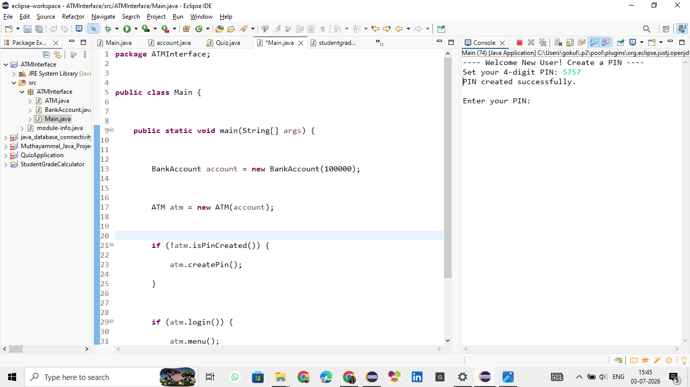
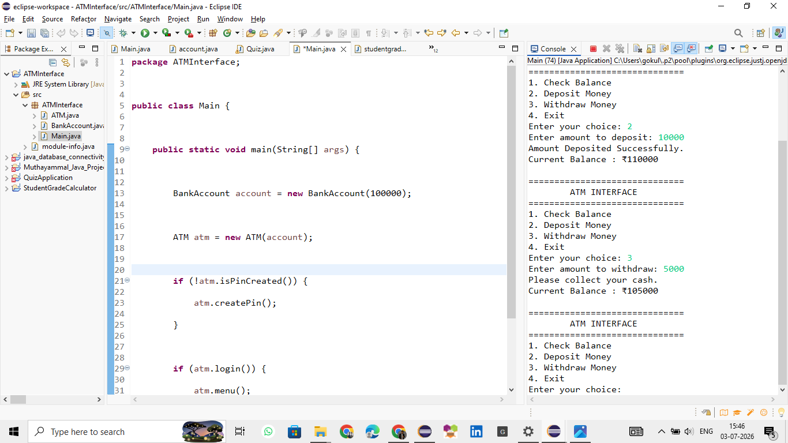
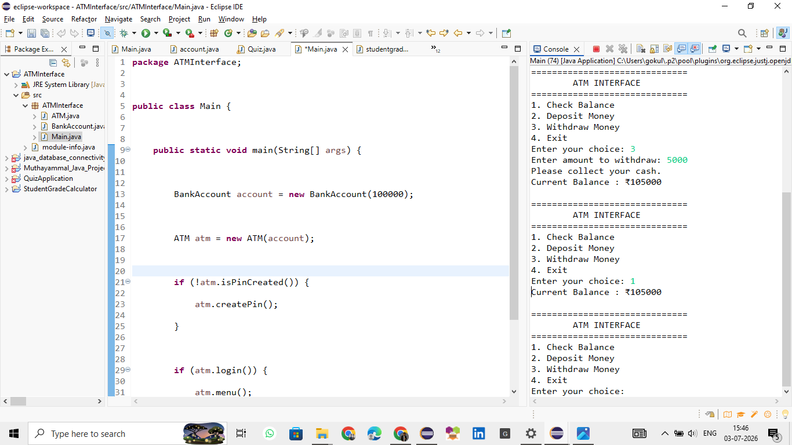
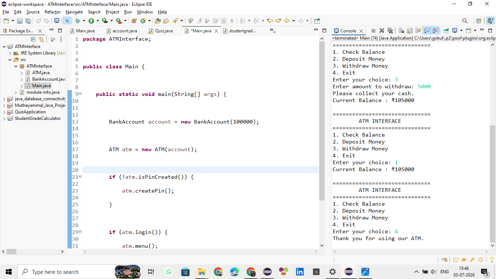

<div align="center">

# 🏧 ATM Interface System

### Secure Java Console-Based Banking Application

A feature-rich ATM Interface developed using **Java** and **Object-Oriented Programming (OOP)** concepts. This application simulates real-world ATM operations such as PIN creation, secure login, deposits, withdrawals, balance inquiry, transaction history, and PIN management.


</div>

---

# 📖 Project Overview

The **ATM Interface System** is a Java console application that replicates the core functionalities of an Automated Teller Machine (ATM). Users can securely create a PIN, log in, perform banking transactions, and manage their account through a simple menu-driven interface.

This project demonstrates Java programming fundamentals, Object-Oriented Programming, user authentication, input validation, and transaction management.

---

# ✨ Key Features

- 🔐 Create a Secure 4-Digit PIN
- 🔑 User Authentication
- 💰 Deposit Money
- 💸 Withdraw Money
- 💳 Check Account Balance
- 📜 Transaction History
- 🔄 Change ATM PIN
- ⚠️ Invalid PIN Handling
- ✅ Input Validation
- 🚪 Exit Application
- 🖥️ Console-Based Interface

---

# 🚀 Application Workflow

```text
Start Application
        │
        ▼
Welcome New User
        │
        ▼
Create 4-Digit PIN
        │
        ▼
PIN Created Successfully
        │
        ▼
Enter PIN
        │
        ▼
Login Successful
        │
        ▼
ATM Dashboard
        │
 ┌──────────┬──────────┬──────────┐
 ▼          ▼          ▼          ▼
Deposit   Withdraw   Balance   History
        │
        ▼
Exit
```

---

# 📸 Application Screenshots

## 👋 Welcome & Create PIN

New users are prompted to create a secure 4-digit PIN.



---

## ✅ PIN Created Successfully

The application confirms successful PIN creation.


---

## 🏧 ATM Dashboard

Displays all available banking operations.


---

## 💰 Deposit Money

Users can securely deposit money into their account.


---

## 💸 Withdraw Money

Withdraw money while checking available balance.



---

## 💳 Balance Inquiry

Displays the current account balance.



---

## 👋 Exit

Safely exits the application.



---

# 🛠 Technologies Used

| Technology | Description |
|------------|-------------|
| ☕ Java | Programming Language |
| 💻 Eclipse IDE | Development Environment |
| 📚 OOP | Object-Oriented Programming |
| ⌨ Scanner Class | User Input |
| 📋 ArrayList | Transaction History |

---

# 📂 Project Structure

```
ATMInterface
│
├── src
│   ├── ATM.java
│   ├── ATMInterface.java
│   └── Main.java
│
├── images
│   ├── welcome-create-pin.png
│   ├── pin-created.png
│   ├── atm-menu.png
│   ├── deposit.png
│   ├── withdraw.png
│   ├── balance.png
│   └── exit.png
│
└── README.md
```

---

# ▶️ Getting Started

## Clone the Repository

```bash
git clone https://github.com/shruthigasri-007/CODSOFT_TASK-3.git
```

## Open the Project

Import the project into **Eclipse IDE**.

## Run

Execute the `Main.java` file.

---

# 🎯 Learning Outcomes

- Java Programming
- Object-Oriented Programming
- Console Application Development
- User Authentication
- Exception Handling
- Banking System Simulation
- Input Validation
- Transaction Management

---

# 🚀 Future Improvements

- 🗄 Database Connectivity
- 👥 Multiple User Accounts
- 🔒 Encrypted PIN Storage
- 📄 Mini Statement Generation
- 📊 Monthly Reports
- 🖥 Java Swing / JavaFX GUI
- ☁ Cloud Database Integration

---

# 👨‍💻 Developer

**Shruthigasri S**

**B.E. **Electronics and Communication Engineering**

---

<div align="center">

### ⭐ If you like this project, don't forget to Star this repository!

**Thank you for visiting this project! ❤️**

</div>

